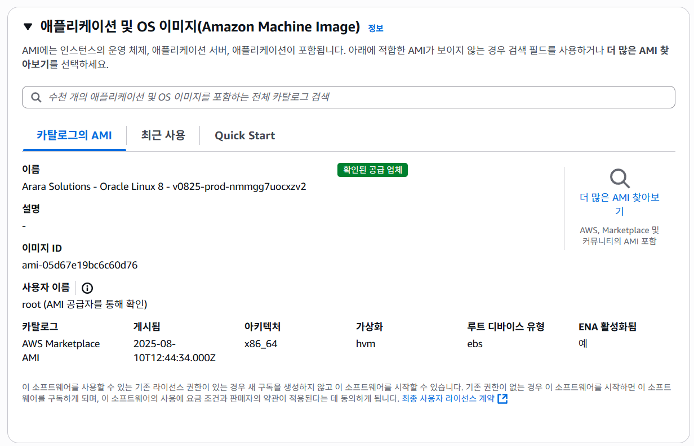
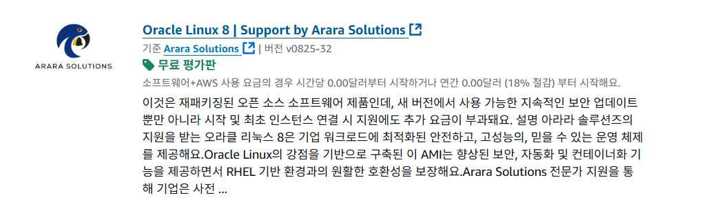
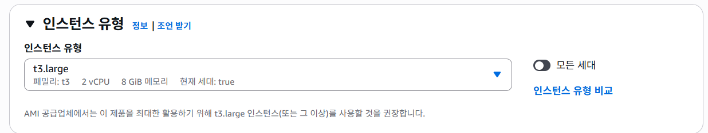
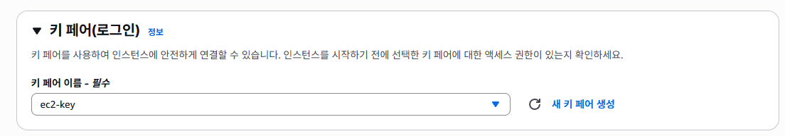
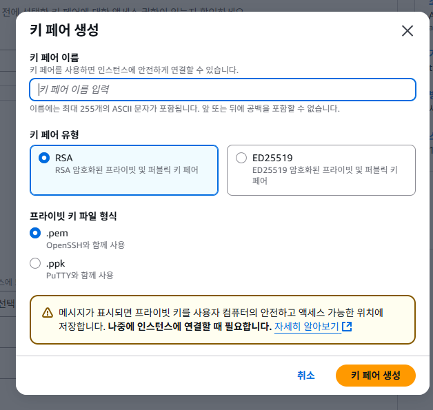
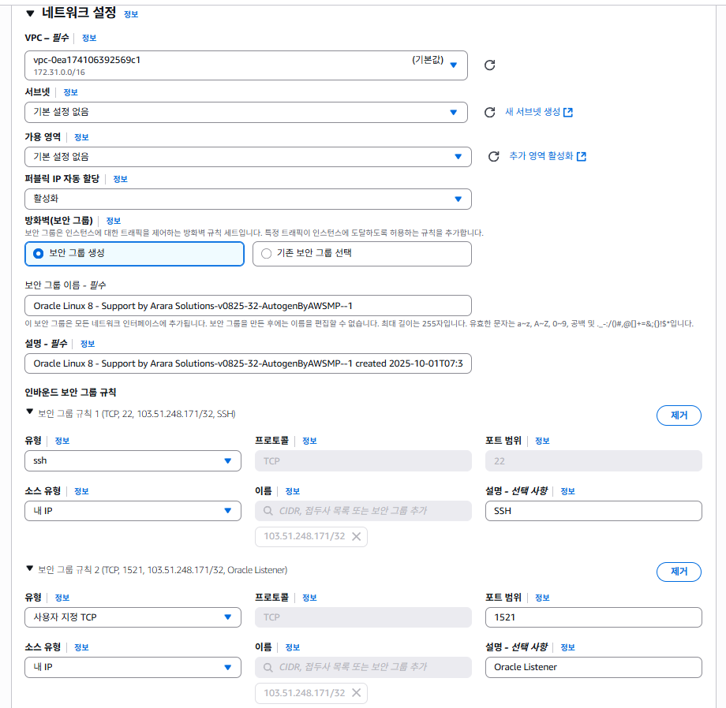

개요
- AWS EC2에 Oracle Linux 8 + Oracle Database XE 21c 설치
- OTT 서비스 ERD 설계 및 가상 데이터 생성
- CSV 업로드 → 외부 테이블 적재 → 내부 테이블 변환 및 제약조건 추가
- SQL 분석 프로세스 (구독 전환율, 유지율, 시청 패턴, 수익 기여도) 수행

ERD

## EC2 인스턴스 생성과 환경 구축 

### Step 1: EC2 인스턴스 시작

### Step 2-1: AMI 선택

### Step 2-2: AMI 상세

### Step 3: 인스턴스 유형 선택

### Step 4: 키 페어 생성

### Step 4-2: 키 페어 상세

### Step 5: 네트워크 설정

### Step 6: 스토리지 설정

