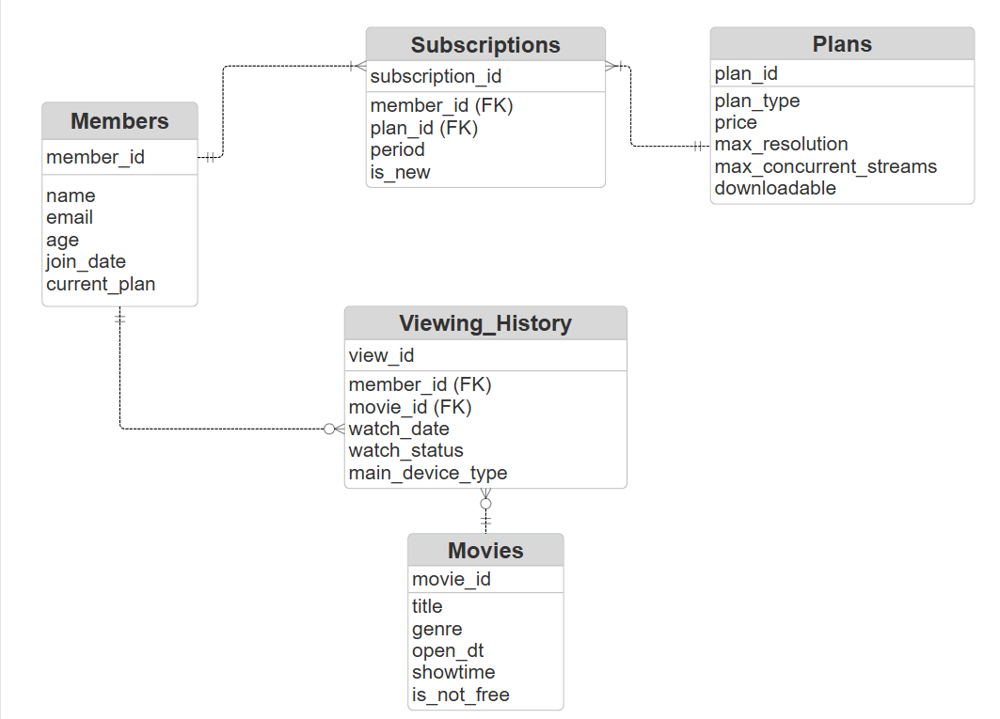
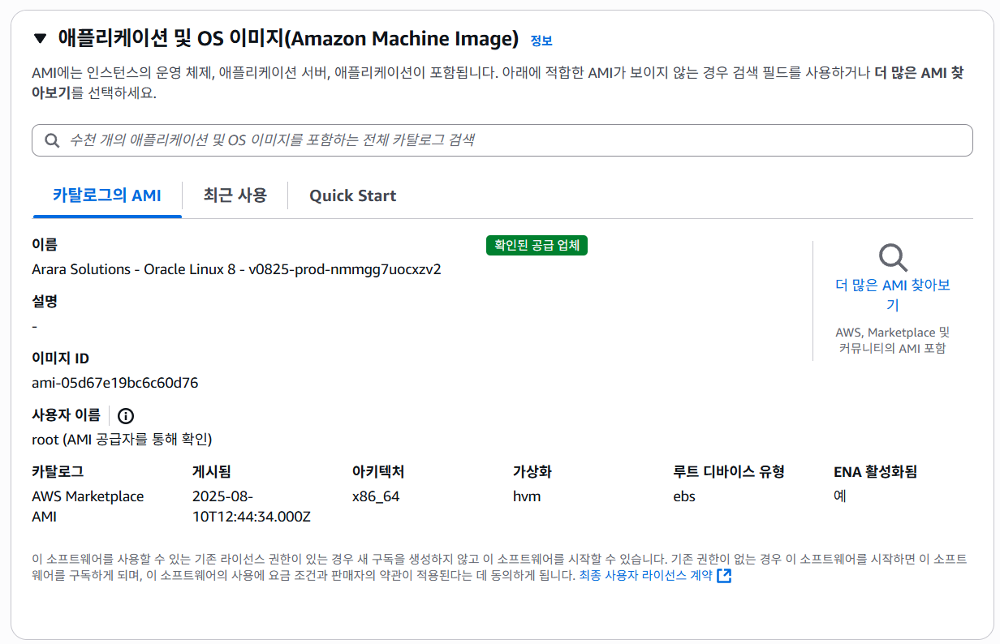
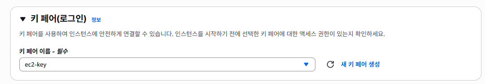
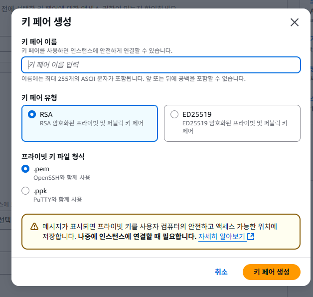
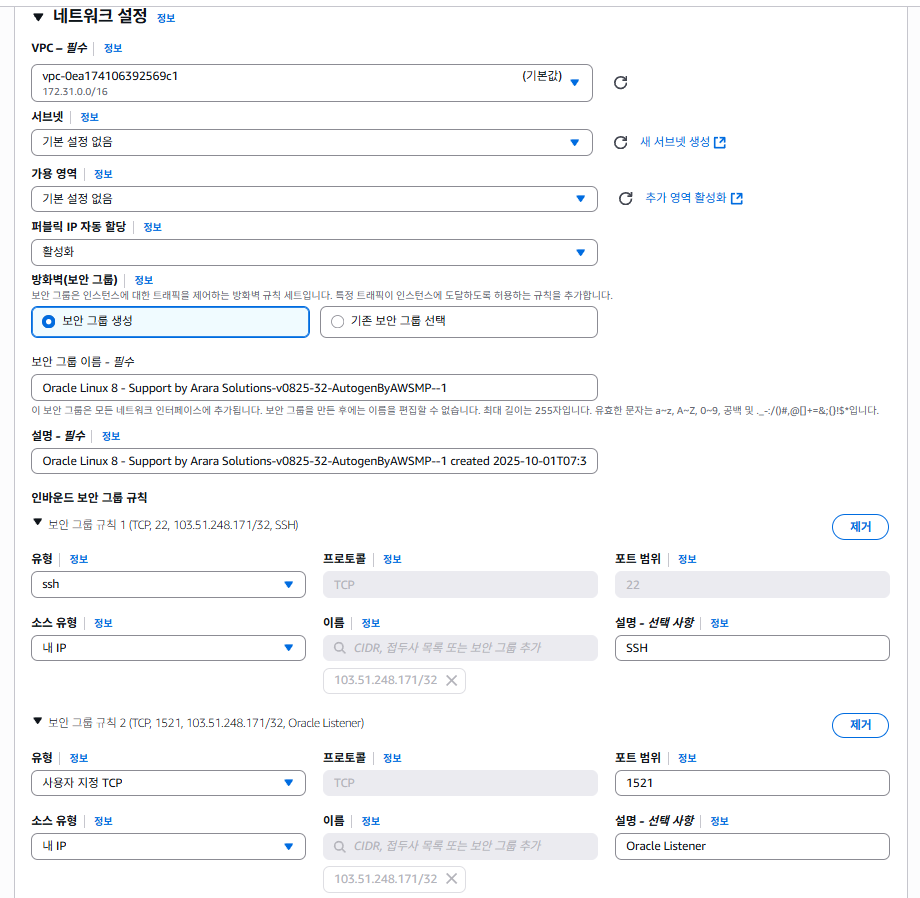

<details>
<summary><h2>개요</h2></summary>

- AWS EC2에 Oracle Linux 8 + Oracle Database XE 21c 설치  
- 가상 OTT 서비스 ERD 설계 및 가상 데이터 생성  
- CSV 업로드 → 외부 테이블 적재 → 내부 테이블 변환 및 제약조건 추가  
- 간단한 SQL 분석 프로세스 (구독 전환율, 유지율, 시청 패턴, 수익 기여도) 수행

### 🎯 참고
본 프로젝트는 **가상 OTT 데이터 모델링 및 Oracle 기반 데이터 집계 실습**을 통해, 데이터베이스 엔지니어링의 핵심 개념과 구조 설계를 직접 구현한 **학습용 프로젝트**입니다.
상용 수준의 Spark나 Oracle EE 환경은 비용과 리소스 제약으로 인해 직접 구현이 어려웠으므로,
**주어진 여건에서 가능한 최선의 환경인 AWS EC2와 Oracle XE**를 활용하여
DB 엔지니어링의 핵심 과정을 간단히 구현하고 실습하는 것을 목표로 하였습니다.

이 과정을 통해 EC2 네트워크 구성, DB 설치 및 접속 설정, 데이터 모델링,
SQL 기반 집계 로직 설계 등 **실제 엔지니어링 업무의 축소형 환경**을 구축하였습니다.


</details>


<details>
<summary><h2>폴더 구조 및 실행 순서</h2></summary>

- project/
  - image/
  - virtual_OTT/
    - data_pipeline/ : 가상 데이터 생성 및 CSV → DB 적재 스크립트
      - fake_data.ipynb
      - SYS.sql
      - ETL.sql
      - DDL.sql
    - analysis_process/ : SQL 분석 프로세스 및 결과
      - TOPIC1.sql
      - TOPIC2.sql
      - TOPIC3.sql
      - TOPIC4.sql

**실행 순서**  
1. fake_data.ipynb 에서 가상 데이터 생성 (csv 파일 생성)  
2. EC2 인스턴스 생성 과정 확인  
3. EC2 환경 구축 확인  
4. ETL, DDL에서 CSV 파일 적재 및 외부 테이블 → 내부 테이블 변환  
5. virtual_OTT/analysis_process/에서 SQL 분석 프로세스 실행 및 결과 확인  

</details>


<details>
<summary><h2>ERD 모델링</h2></summary>



</details>


<details>
<summary><h2>EC2 인스턴스 생성</h2></summary>

### Step 1: EC2 인스턴스 시작  


### Step 2-1: AMI 선택  


### Step 2-2: 구독한 AMI  


### Step 3: 인스턴스 유형 선택  


### Step 4: 키 페어 생성  


### Step 4-2: 키 페어 상세  


### Step 5: 네트워크 설정  


### Step 6: 스토리지 설정  


</details>


<details>
<summary><h2>EC2 환경 구축</h2></summary>

```bash
# 1. SSH 접속 (키 파일이 있는 경로에서 실행)
ssh -i "<your-key.pem>" ec2-user@<public-ip-address>

# 2. 시스템 업데이트
sudo dnf update -y

# 3. 필요한 패키지 설치
sudo dnf install -y oracle-database-preinstall-21c wget unzip

# 4. Oracle XE 설치 파일 업로드 (로컬 → EC2)
scp -i "<your-key.pem>" <local-path-to-rpm>/oracle-database-xe-21c-1.0-1.ol8.x86_64.rpm ec2-user@<public-ip-address>:/tmp/

# 5. rpm 패키지 설치 (EC2 내부)
cd /tmp
sudo dnf localinstall -y oracle-database-xe-21c-1.0-1.ol8.x86_64.rpm

# 6. 초기 설정 및 비밀번호 지정
sudo /etc/init.d/oracle-xe-21c configure

# 7. 서비스 상태 확인
ps -ef | grep pmon
ps -ef | grep tnslsnr
sudo ss -ltnp | grep 1521

# 8. 방화벽 설정 (필요 시)
sudo firewall-cmd --add-port=1521/tcp --permanent
sudo firewall-cmd --reload
sudo firewall-cmd --list-all

# 9. Oracle Developer 접속 후 DB 상태 확인

SQL Developer에서 새로운 연결(New Connection)을 생성

- Connection Name: 임의로 지정 (예: `EC2-OracleXE`)
- Username: system (또는 생성한 사용자 계정명, 예: `movies`)
- Password: 설치 시 `sudo /etc/init.d/oracle-xe-21c configure` 단계에서 설정한 비밀번호
- Hostname: EC2 퍼블릭 IPv4 주소 (예: `16.xxx.xxx.xxx`)
- Port: 1521
- Service Name: xepdb1

연결 후 SQL Worksheet에서 아래 쿼리를 실행해 DB 상태를 확인
SQL> SELECT host_name, instance_name, version FROM v$instance;

# 10. CSV 파일 업로드 및 권한 설정

1. 업로드 받을 디렉토리 생성 (ec2-user 홈 디렉토리)
mkdir -p /home/ec2-user/csv_dir
2. 로컬 PC → EC2로 CSV 업로드
scp -i "<your-key.pem>" <local-path-to-csv>/*.csv ec2-user@<public-ip-address>:/home/ec2-user/csv_dir/
3. Oracle XE가 접근할 수 있는 디렉토리로 복사
sudo cp /home/ec2-user/csv_dir/*.csv /opt/oracle/admin/XE/dpdump/
4. 소유자와 그룹 변경 (oracle:oinstall)
sudo chown oracle:oinstall /opt/oracle/admin/XE/dpdump/*.csv
5. 퍼미션 설정 (읽기 가능)
sudo chmod 644 /opt/oracle/admin/XE/dpdump/*.csv
6. 최종 확인
sudo ls -l /opt/oracle/admin/XE/dpdump/ | grep csv
```
</details>

<details>
<summary><h2>분석 프로세스</h2></summary>


<summary><h3>Topic 1: 고객들의 플랜 업그레이드 비율</h3></summary>

**분석 항목**  
1-1. Free → Basic/Premium 업그레이드율  
1-2. Free 가입자가 처음 업그레이드하기까지 걸린 시간  
1-3. 업그레이드 후 3개월 이상 유지율  

**분석 결과 요약**  
- Free 신규 가입자의 다음 달 유료 전환율 ≈ 77~78%  
- Free 가입자의 약 79%가 1개월 내 전환, 95% 이상이 2개월 내 전환  
- 업그레이드 후 3개월 이상 연속 유료 유지 비율 ≈ 70%


<summary><h3>Topic 2: 무료 가입 고객의 시청 패턴 변화</h3></summary>

**분석 항목**  
- 무료 가입자의 업그레이드 전 평균 시청 횟수  
- 유료 업그레이드 직후 시청 횟수 변화율  
- 유료 콘텐츠 비중  

**분석 결과 요약**  
- 무료 가입자는 평균 1.4편 → 유료 전환 직후 2.1편 (65% 증가)  
- 전환 직후 유료 콘텐츠 비중은 약 3.8%  


<summary><h3>Topic 3: 시청 횟수와 유료 플랜 유지 기간의 관계</h3></summary>

**분석 항목**  
- 고객을 시청 횟수 기준 Low / Medium / High 3그룹으로 분류  
- 그룹별 유료 플랜 유지 개월 수 비교  

**분석 결과 요약**  
- High: 단기 집중 후 빠른 해지 ("폭식형")  
- Medium: 평균적 유지  
- Low: 시청 적지만 장기 유지 ("깜빡 구독")  


<summary><h3>Topic 4: 수익 기여도 분석</h3></summary>

**분석 항목**  
4-1. 플랜별 수익 기여도  
4-2. 연령대별 ARPU(1인당 평균 매출)  
> *가중치 산식: 구독료 + 0.1 × 시청 횟수*

**분석 결과 요약**  
- Premium ≈ 1억7천만 / Basic ≈ 9천만 / Free ≈ 65만  
- 20~30대가 전체 매출을 주도, ARPU 세대별 차이는 크지 않음  


</details>


<details>
<summary><h3>정리</h3></summary>

## 의의
- AWS EC2 환경에 **Oracle Linux + Oracle XE 21c**를 직접 구축하고, 외부 데이터를 ETL 파이프라인으로 적재하여 **엔드투엔드 데이터 분석 흐름**을 실습한 경험  
- OTT 서비스 ERD 모델링부터 가상 데이터 생성, CSV 업로드, 외부 테이블 → 내부 테이블 변환, 제약조건 적용, SQL 분석 프로세스 실행까지의 **데이터 분석 사이클 전체를 구현**  
- 데이터베이스 기반 분석에서 **설계 → 데이터 준비 → 분석 → 결과 도출**의 전 과정을 경험하며,  
  이후 실제 대용량 환경에서의 확장 및 최적화 방향(병렬, 파티셔닝, 인덱스 튜닝 등)을 고민할 수 있는 토대 마련

## 한계점
- 가상 데이터는 일정한 형식과 가중치를 부여해 생성되었기 때문에, 실제 서비스 환경에서 발생하는 **비정형적/비선형적 데이터 패턴**을 완전히 반영하지 못함  
- Oracle XE 무료 버전 환경에서는 **파티션, 병렬 처리, 고급 튜닝 기능** 등을 지원하지 않아  대규모 OLAP 환경에서의 **병렬 처리 성능 비교나 파티션 전략 실험**을 수행할 수 없었음

## 여담
- OLAP 환경에서 적절한 인덱스를 설계하여 쿼리를 실행해본 결과, **버퍼 사용량은 줄었지만 실행 시간 단축 효과는 미미**했음. 오히려 **인덱스 유지로 인한 DML 경합**이 발생할 수 있다는 점에서, 대규모 집계 환경에서는 인덱스 기반 최적화보다는 **병렬 처리, 파티셔닝, 집계 전략 설계**가 더 효과적이라는 것을 실습을 통해 체감.
- 동일한 쿼리를 로컬 PC에서 실행했을 때보다, EC2 환경에서 원격 접속하여 실행할 경우 시간이 **약 2~3배 더 소요**됨을 확인. 이는 네트워크를 통한 **User Call 비용**이 성능에 중요한 영향을 미친다는 점을 보여주며, 실제 대규모 환경에서 **User Call 최소화**(불필요한 쿼리 호출 줄이기, Batch 처리, 효율적 SQL 작성)가 중요하다는 걸 실감함.

</details>

