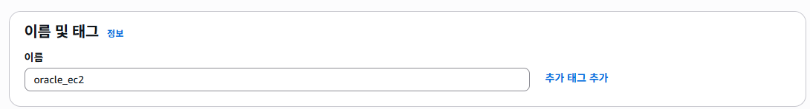

<details>
<summary><h2>개요</h2></summary>
· AWS EC2에 Oracle Linux 8 + Oracle Database XE 21c 설치
  <br>
· OTT 서비스 ERD 설계 및 가상 데이터 생성
  <br>
· CSV 업로드 → 외부 테이블 적재 → 내부 테이블 변환 및 제약조건 추가
  <br>
· SQL 분석 프로세스 (구독 전환율, 유지율, 시청 패턴, 수익 기여도) 수행

</details>

<details>
<summary><h2>폴더 구조 및 실행 순서</h2></summary>

<br>

- project/
  - image/
  - virtual_OTT/
    - data_pipeline/ : 가상 데이터 생성 및 CSV → DB 적재 스크립트
      - fake_data.ipynb
      - SYS.sql
      - ETL.sql
      - DDL.sql
    - analysis_process/ : SQL 분석 프로세스 및 결과
      - TOPIC1.sql
      - TOPIC2.sql
      - TOPIC3.sql
      - TOPIC4.sql


**실행 순서**  
1. fake_data.ipynb 에서 가상 데이터 생성 (csv 파일 생성)
2. EC2 인스턴스 생성 과정 확인  
3. EC2 환경 구축 확인
4. ETL, DDL에서 CSV 파일 적재 및 외부 테이블 → 내부 테이블 변환  
6. virtual_OTT/analysis_process/에서 SQL 분석 프로세스 실행 및 결과 확인  

</details>


<details>
<summary><h2>ERD 모델링</h2></summary>

<br>


</details>


<details>
<summary><h2>EC2 인스턴스 생성</h2></summary>

## Step 1: EC2 인스턴스 시작  


## Step 2-1: AMI 선택  


## Step 2-2: 구독한 AMI  


## Step 3: 인스턴스 유형 선택  


## Step 4: 키 페어 생성  


## Step 4-2: 키 페어 상세  


## Step 5: 네트워크 설정  


## Step 6: 스토리지 설정  


</details>


<details>
<summary><h2>EC2 환경 구축</h2></summary>

```bash
# 1. SSH 접속 (키 파일이 있는 경로에서 실행)
ssh -i "<your-key.pem>" ec2-user@<public-ip-address>

# 2. 시스템 업데이트
sudo dnf update -y

# 3. 필요한 패키지 설치
sudo dnf install -y oracle-database-preinstall-21c wget unzip

# 4. Oracle XE 설치 파일 업로드 (로컬 → EC2)
scp -i "<your-key.pem>" <local-path-to-rpm>/oracle-database-xe-21c-1.0-1.ol8.x86_64.rpm ec2-user@<public-ip-address>:/tmp/

# 5. rpm 패키지 설치 (EC2 내부)
cd /tmp
sudo dnf localinstall -y oracle-database-xe-21c-1.0-1.ol8.x86_64.rpm

# 6. 초기 설정 및 비밀번호 지정
sudo /etc/init.d/oracle-xe-21c configure

# 7. 서비스 상태 확인
ps -ef | grep pmon
ps -ef | grep tnslsnr
sudo ss -ltnp | grep 1521

# 8. 방화벽 설정 (필요 시)
sudo firewall-cmd --add-port=1521/tcp --permanent
sudo firewall-cmd --reload
sudo firewall-cmd --list-all

## 9. Oracle Developer 접속 후 DB 상태 확인

SQL Developer에서 새로운 연결(New Connection)을 생성

- Connection Name: 임의로 지정 (예: `EC2-OracleXE`)
- Username: system (또는 생성한 사용자 계정명, 예: `movies`)
- Password: 설치 시 `sudo /etc/init.d/oracle-xe-21c configure` 단계에서 설정한 비밀번호
- Hostname: EC2 퍼블릭 IPv4 주소 (예: `16.xxx.xxx.xxx`)
- Port: 1521
- Service Name: xepdb1

연결 후 SQL Worksheet에서 아래 쿼리를 실행해 DB 상태를 확인
SQL> SELECT host_name, instance_name, version FROM v$instance;

# 10. CSV 파일 업로드 및 권한 설정
mkdir -p /home/ec2-user/csv_dir
scp -i "<your-key.pem>" <local-path-to-csv>/*.csv ec2-user@<public-ip-address>:/home/ec2-user/csv_dir/
sudo cp /home/ec2-user/csv_dir/*.csv /opt/oracle/admin/XE/dpdump/


<details>
<summary><h2>분석 프로세스</h2></summary>

<br>

<details>
<summary><h3>Topic 1: 고객들의 플랜 업그레이드 비율</h3></summary>

**분석 항목**  
1-1. Free → Basic/Premium 업그레이드율  
1-2. Free 가입자가 처음 업그레이드하기까지 걸린 시간  
1-3. 업그레이드 후 3개월 이상 유지율  

**분석 결과 요약**  
- Free 신규 가입자의 **다음 달 유료 전환율 ≈ 77~78%** (월별 차이 거의 없음). :contentReference[oaicite:0]{index=0}  
- Free 가입자의 **약 79%가 1개월 내 전환**, **95%+가 2개월 내 전환**(그 이후 전환은 드묾). :contentReference[oaicite:1]{index=1}  
- 업그레이드 후 **3개월 이상 연속 유료 유지 비율 ≈ 70%**. :contentReference[oaicite:2]{index=2}  

</details>

<details>
<summary><h3>Topic 2: 무료 가입 고객의 시청 패턴 변화</h3></summary>

**분석 항목**  
- 무료 가입자의 업그레이드 전 평균 시청 횟수  
- 유료 업그레이드 직후 시청 횟수 변화율  
- 유료(유료 콘텐츠) 비중  

**분석 결과 요약**  
- 무료 가입자는 **평균 1.4편** 시청 → 유료 전환 직후 **2.1편**으로 증가(**약 65% 증가**). :contentReference[oaicite:3]{index=3}  
- 전환 직후 **유료 콘텐츠 비중은 약 3.8%**로 낮아, 매출로의 실제 연결은 제한적. :contentReference[oaicite:4]{index=4}  

</details>

<details>
<summary><h3>Topic 3: 시청 횟수와 유료 플랜 유지 기간의 관계</h3></summary>

**분석 항목**  
- 고객을 시청 횟수 기준 Low / Medium / High 3그룹으로 분류  
- 그룹별 유료 플랜 유지 개월 수 비교  

**분석 결과 요약**  
- **시청량과 유지기간이 오히려 반비례** 경향:  
  - High: 단기 집중 시청 후 **빠른 해지(‘폭식형’)**,  
  - Medium: 평균적 시청·평균 유지,  
  - Low: 시청 적지만 **장기 유지(‘깜빡/안심 구독’)**. :contentReference[oaicite:5]{index=5}  

</details>

<details>
<summary><h3>Topic 4: 수익 기여도 분석</h3></summary>

**분석 항목**  
4-1. 플랜별 수익 기여도  
4-2. 연령대별 ARPU(1인당 평균 매출) 및 주요 기여 세대  
> *가중치 산식: **구독료 + 0.1 × 시청 횟수**(시청 활동을 금액화하여 가중치 반영)* :contentReference[oaicite:6]{index=6}

**분석 결과 요약**  
- **플랜별**: Premium이 **최대 기여(≈ 1억7천만)**, Basic은 **그 절반 규모(≈ 9천만)**, Free는 **매우 미미(≈ 65만)**. :contentReference[oaicite:7]{index=7}  
- **연령대별**: ARPU **세대 간 차이는 작음(≈ 9%)**, **전체 수익은 20~30대 가입자 규모가 주도**. :contentReference[oaicite:8]{index=8}  

</details>

</details>
sudo chown oracle:oinstall /opt/oracle/admin/XE/dpdump/*.csv
sudo chmod 644 /opt/oracle/admin/XE/dpdump/*.csv
sudo ls -l /opt/oracle/admin/XE/dpdump/ | grep csv
